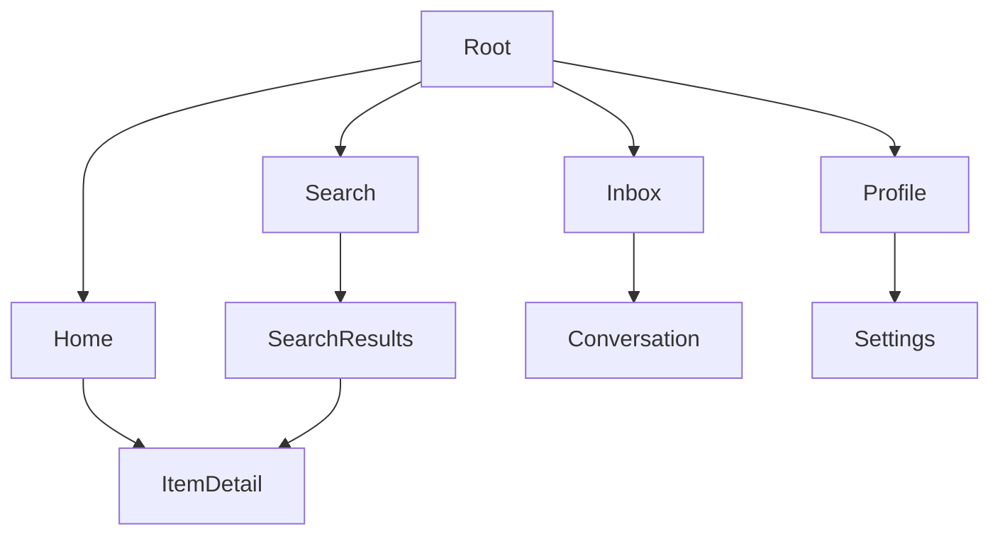

# UI/UX Design Specification Template

Use this as the literal skeleton of the generated spec. Every section below should appear in the final document. If a section doesn't apply, write "Not applicable because [reason]" rather than removing it.

---

```markdown
# UI/UX Design Specification — [Product Name]

**Version:** 1.0
**Date:** [YYYY-MM-DD]
**Status:** Draft / Approved / Locked
**Source PRD:** [link or path]

## Change Log
| Version | Date | Author | Changes |
|---|---|---|---|
| 1.0 | YYYY-MM-DD | — | Initial spec |

---

## 1. Product Context

[One paragraph: what this app does, who it's for, what the UI must accomplish. Cite PRD sections.]

## 2. Design Principles

Three to seven principles specific to this product. These override generic best practices when they conflict.

1. **[Principle name]** — [One sentence describing it. One sentence on what trade-off it implies.]
2. ...

## 3. User Archetypes & Primary Flows

### Archetype A: [Name]
- **Who:** [one-sentence description]
- **Primary job:** [what they're trying to accomplish]
- **Critical path:** [step-by-step flow through the app]
- **Frequency:** [daily / weekly / one-time]
- **Sophistication:** [novice / intermediate / power user]

### Archetype B: ...

### Cross-cutting flows

1. **First-time user activation** — [step-by-step from app open to first value delivered]
2. **Returning user steady state** — [most common 30-second session]
3. **Power user shortcuts** — [if applicable]

## 4. Information Architecture

App structure as a text tree:

```
Root
├── Tab 1: Home
│   ├── Detail screen A
│   └── Detail screen B
├── Tab 2: Search
│   └── Search results
│       └── Result detail
├── Tab 3: Inbox
│   └── Conversation
└── Tab 4: Profile
    ├── Settings
    │   ├── Account
    │   ├── Notifications
    │   └── Privacy
    └── Help
```

[Justify the chosen IA in 2–3 sentences, tied to the user archetypes.]

## 5. Design Principles Reference

Apply the following from `references/uiux-fundamentals.md`:
- Navigation hierarchy levels
- Three wayfinding questions
- One primary action per screen
- Reversibility
- State coverage
- Touch targets
- Feedback latency
- Consistency over cleverness
- Density
- Forms
- Empty states
- Error messages
- Loading
- Motion
- Accessibility
- Responsive behavior
- Modal discipline
- Copy voice

## 6. Navigation System

### 6.1 Primary navigation paradigm

[Tab bar / Sidebar / etc.] — [why this choice]

### 6.2 Navigation hierarchy diagram



### 6.3 Back behavior

| From | Back goes to |
|---|---|
| Home → ItemDetail | Home, scroll position restored |
| Search → ItemDetail | Search results, query and scroll restored |
| Modal | Underlying screen, no state change |
| Deep link to ItemDetail (unauthenticated) | Sign-in screen → on success → ItemDetail |
| ... | ... |

### 6.4 Deep link map

| URL | Screen | Auth required | Behavior if not authed |
|---|---|---|---|
| `/` | Home | No | Show home |
| `/item/:id` | ItemDetail | No | Show item |
| `/inbox` | Inbox | Yes | Sign-in → return to /inbox |
| `/profile/settings` | Settings | Yes | Sign-in → return to /profile/settings |

### 6.5 Tab state persistence

| Tab | State preserved across switches |
|---|---|
| Home | Scroll position, applied filters |
| Search | Query, results, scroll, filters |
| Inbox | Selected conversation, scroll |
| Profile | None — always reset to root |

### 6.6 Modal vs sheet vs full-screen decision rules

- **Modal (centered overlay):** confirmations only. Single decision. ≤3 fields. iOS/Android-style alert.
- **Bottom sheet (mobile):** selection from a list, quick filters, action menus. Dismissible by swipe down or tap outside.
- **Full-screen route:** anything longer than the above, anything that benefits from a URL, anything multi-step.

### 6.7 Cross-flow handoffs

[How the user moves between major flows. Example: tapping a notification from Settings should open Inbox; back button should go to Settings, not Inbox root.]

### 6.8 Header/chrome rules

- Headers appear on all level 2+ screens with title and back button.
- Tab bar appears on all level 1 screens; hidden when keyboard is open on mobile.
- ...

### 6.9 First-run navigation

[Where does a brand-new user land? What do they see? Where are they guided next?]

### 6.10 Notification → screen mapping

| Notification | Opens screen | Back goes to |
|---|---|---|
| New message | Conversation | Inbox |
| Mention | Item detail | Home |

### 6.11 Search entry points

[Where is search reachable from? Always-visible field on Home, magnifying-glass icon on Inbox header, etc.]

### 6.12 Error routes

- **404:** Friendly screen, "Take me home" CTA, search field
- **Expired link:** Explain, offer to refresh
- **Auth required:** Show sign-in, preserve intended destination, redirect after auth

## 7. Screen Inventory

| # | Screen | Route | Level | Primary action | Entry points | Exit points |
|---|---|---|---|---|---|---|
| 1 | Home | `/` | 1 | Browse items | App open, Home tab | ItemDetail, Search |
| 2 | ItemDetail | `/item/:id` | 2 | Engage with item | Home, Search, deep link | Back, related items |
| ... | ... | ... | ... | ... | ... | ... |

## 8. Screen Specifications

[One subsection per screen, following the per-screen template in SKILL.md Step 4]

### 8.1 Home

**Route:** `/`
**Purpose:** Show the user the most relevant items to engage with.
**Primary user action:** Tap an item to view detail.
**Entry points:** App launch, Home tab tap, post-onboarding.
**Exit points:** ItemDetail, Search (via header search field).

**Layout (top to bottom):**
- Header: greeting + avatar (top right) + search icon
- Hero section: featured item carousel
- List section: feed of items in chronological order
- Tab bar (persistent)

**Components used:** Header, Avatar, SearchIcon, FeaturedCarousel, ItemCard, TabBar

**Data shown:**
- User's first name (from session)
- Featured items (from /api/featured)
- Feed items (from /api/feed)

**States:**
- Empty (new user, no feed): show onboarding hero, "Follow some topics" CTA
- Loading: skeleton cards (5 of them)
- Error: full-screen error with retry; if cached data exists, show it with a "Couldn't refresh" banner
- Partial: show what loaded, skeleton placeholders for what hasn't
- Populated: feed as specified

**Interactions:**
- Pull to refresh: spinner at top, refetches feed
- Tap item: route push to ItemDetail with slide-from-right transition
- Tap search icon: push to Search screen
- Tap avatar: open profile menu (bottom sheet on mobile, dropdown on desktop)

**Edge cases:**
- Very long item titles: truncate to 2 lines with ellipsis
- Missing item images: show themed placeholder
- 1000+ items: virtualize the list

**Accessibility:**
- Focus order: header → search → first item → ... → tab bar
- Item cards have aria-labels: "Open item: [title]"
- Pull-to-refresh announces "Refreshing" then "Updated" or "Refresh failed"

**Responsive behavior:**
- Mobile (<768px): single column
- Tablet (768–1024px): 2 columns
- Desktop (>1024px): 3 columns + sidebar nav replaces tab bar

**Analytics events:**
- `home_viewed`
- `home_item_tapped` { item_id, position }
- `home_search_tapped`

### 8.2 [Next screen]
...

## 9. Component Library

For each reusable component:

### 9.1 Button

**Variants:** primary, secondary, tertiary, destructive, ghost
**Sizes:** sm (32px), md (40px), lg (48px)
**States:** default, hover, pressed, focused, disabled, loading
**Anatomy:** [icon (optional)] + label + [trailing icon (optional)]
**Spec:**
- Primary: filled, brand color background, white text
- Min width: enough for label + 16px padding each side
- Border radius: 8px (token: `radius.md`)
- Font: medium weight, 16px
- Loading state: replace label with spinner; preserve width

### 9.2 Input
[Similar structure]

### 9.3 Card
...

[Continue for every reusable component]

## 10. Design Tokens

### Colors

```
Brand
  primary:        #2563EB
  primary-hover:  #1D4ED8
  primary-pressed:#1E40AF

Neutral (light mode)
  bg:             #FFFFFF
  bg-elevated:    #FAFAFA
  surface:        #F4F4F5
  text:           #18181B
  text-secondary: #52525B
  text-tertiary:  #A1A1AA
  border:         #E4E4E7
  border-strong:  #D4D4D8

Semantic
  success:        #16A34A
  warning:        #D97706
  error:          #DC2626
  info:           #2563EB

Dark mode equivalents
  ...
```

### Typography

```
Font family:
  default: Inter, -apple-system, system-ui, sans-serif
  mono:    JetBrains Mono, monospace

Scale (rem; 1rem = 16px):
  xs:  0.75   (12px) — captions
  sm:  0.875  (14px) — secondary text
  base: 1.0   (16px) — body
  lg:  1.125  (18px) — emphasized body
  xl:  1.25   (20px) — section headings
  2xl: 1.5    (24px) — page headings
  3xl: 1.875  (30px) — hero headings
  4xl: 2.25   (36px) — display

Weights:
  regular: 400
  medium:  500
  semibold:600
  bold:    700

Line heights:
  tight: 1.2  (headings)
  normal: 1.5 (body)
  relaxed: 1.7 (reading-heavy)
```

### Spacing (4px base)

```
0: 0
1: 4px
2: 8px
3: 12px
4: 16px
5: 20px
6: 24px
8: 32px
10: 40px
12: 48px
16: 64px
20: 80px
```

### Radii

```
none: 0
sm:   4px
md:   8px
lg:   12px
xl:   16px
2xl:  24px
full: 9999px
```

### Shadows

```
sm:  0 1px 2px rgba(0,0,0,0.05)
md:  0 4px 6px -1px rgba(0,0,0,0.10), 0 2px 4px -2px rgba(0,0,0,0.05)
lg:  0 10px 15px -3px rgba(0,0,0,0.10), 0 4px 6px -4px rgba(0,0,0,0.05)
xl:  0 20px 25px -5px rgba(0,0,0,0.10), 0 8px 10px -6px rgba(0,0,0,0.04)
```

### Motion

```
Durations:
  instant: 0ms
  micro:   100ms
  fast:    150ms
  base:    200ms
  slow:    300ms
  slower:  500ms

Easings:
  standard:   cubic-bezier(0.2, 0, 0, 1)
  decelerate: cubic-bezier(0, 0, 0, 1)
  accelerate: cubic-bezier(0.4, 0, 1, 1)
  emphasized: cubic-bezier(0.2, 0, 0, 1.4)
```

## 11. Interaction Patterns

### Gestures (mobile)
- Swipe right from screen edge: back
- Swipe down on modal/sheet: dismiss
- Pull down on list: refresh
- Long-press on item: contextual menu
- Pinch on image: zoom

### Keyboard shortcuts (web)
- `/`: focus search
- `Esc`: close modal / go back
- `Cmd+K`: command palette (if applicable)
- `j` / `k`: navigate next / previous item in lists
- Document every shortcut in a help overlay accessible via `?`

### Focus management
- On route change, focus moves to the page heading (h1)
- On modal open, focus moves to the modal's first interactive element
- On modal close, focus returns to the element that opened it
- Focus traps within modals — Tab doesn't escape the modal

## 12. State Coverage Matrix

| Screen | Empty | Loading | Error | Partial | Populated | Auth req | Offline |
|---|---|---|---|---|---|---|---|
| Home | ✅ §8.1 | ✅ §8.1 | ✅ §8.1 | ✅ §8.1 | ✅ §8.1 | N/A | ✅ §8.1 |
| ... | | | | | | | |

[Every cell must be ✅ or N/A with a reason. ❌ or blank = missing spec.]

## 13. Responsive Behavior

### Breakpoints
- **Mobile:** <768px
- **Tablet:** 768–1023px
- **Desktop:** 1024–1439px
- **Wide:** ≥1440px (max content width 1440px)

### What changes per breakpoint

| Aspect | Mobile | Tablet | Desktop |
|---|---|---|---|
| Primary nav | Bottom tab bar | Bottom tab bar | Left sidebar |
| Feed columns | 1 | 2 | 3 |
| Modal style | Bottom sheet | Centered | Centered |
| Search | Icon → screen | Icon → screen | Inline in header |
| Density | Comfortable | Comfortable | Compact |

## 14. Accessibility Specification

- **WCAG target:** AA across all screens, AAA on critical-path text
- **Contrast minimums:** text 4.5:1, large text & UI 3:1
- **Min touch target:** 44×44pt on mobile
- **Focus visible:** outline of 2px with 3:1 contrast against bg, offset 2px
- **Reduced motion:** respect `prefers-reduced-motion`; substitute opacity for slide/scale
- **Screen reader support:** every interactive element has accessible name; dynamic content announced via live regions
- **Keyboard nav (web):** every interactive element reachable; logical Tab order; no keyboard traps except modals (which trap intentionally)
- **Text scaling:** layout intact at 200% zoom; nothing clipped or overlapping
- **Color independence:** no information conveyed by color alone — pair with icon, text, or pattern

## 15. Motion & Animation

[See tokens in §10. Specify per-context here.]

- Page transitions (push): slide-from-right, 250ms, standard easing
- Page transitions (pop): slide-out-to-right, 250ms, standard easing
- Modal open: fade + scale from 0.95 to 1.0, 200ms, decelerate
- Modal close: fade + scale to 0.95, 150ms, accelerate
- Bottom sheet: slide-up from bottom, 300ms, standard easing
- Tab switch: instant; no slide
- Skeleton shimmer: 1.5s loop, linear
- Pull-to-refresh: rubber-band overscroll, spring physics
- Reduced motion: replace all slides and scales with fade-only

## 16. Copy & Voice

### Tone
[Conversational / Friendly / etc. — picked in clarifying questions]

### Voice rules
- Active voice, second person ("You can edit this anytime")
- Sentence case for headings and buttons
- Plain language — no internal jargon
- Show empathy in errors; don't blame the user

### Microcopy examples

**Empty states:**
- ✅ "Nothing here yet. Tap + to add your first item."
- ❌ "No items found."

**Success:**
- ✅ "Saved." (toast, 2s)
- ❌ "Your changes have been successfully saved to the database."

**Error:**
- ✅ "Couldn't save. Check your connection and try again." [Retry button]
- ❌ "Error: Network request failed (code 500)"

**Confirmations:**
- ✅ Title: "Delete this conversation?" Body: "This can't be undone." Buttons: "Cancel" | "Delete"
- ❌ Title: "Are you sure?" Body: "This action will permanently delete the selected item."

### Button labels
- Always verbs
- Tell the user what'll happen
- Examples: "Save changes", "Send invite", "Delete account" — not "OK", "Submit", "Continue"

## 17. Open Questions

| # | Question | Owner | Target date |
|---|---|---|---|
| 1 | [Open question] | [Person] | [Date] |

Mark every assumption made in this spec as `[ASSUMPTION]` in-line; aggregate them here.

---

End of spec.
```
